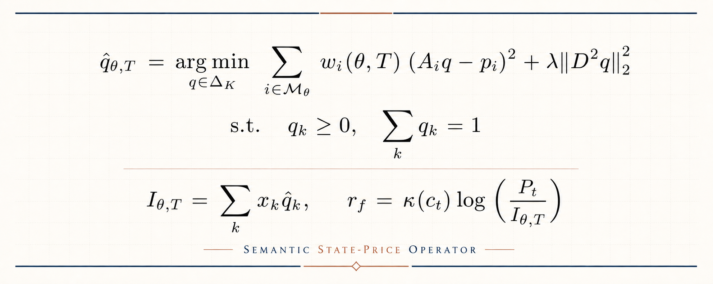

# Semantic State Prices

**Inferring latent indices from prediction-market event securities.**

[Read the PDF](paper/semantic-state-prices.pdf) · [Read the manuscript](paper/semantic-state-prices.md) · [View the data](data/empirical_summary.md)



## Abstract

Prediction markets trade thousands of binary contracts tied to future states of the world. This repository shows how to treat related contracts as noisy state-price observations, project them into a coherent latent distribution, and report the resulting expectation as an index candidate. The intended use is an oracle input for perpetual futures on variables that do not have native spot markets.

The manuscript validates the method on Polymarket crypto ladders and a Kalshi weather panel, then applies it to OpenAI 2027 valuation markets and compares the result with Hyperliquid pre-IPO perpetuals.

## Core Operator

```text
q_hat(theta,T) = argmin_q sum_i w_i(theta,T) (A_i q - p_i)^2 + lambda ||D^2 q||_2^2

subject to:
q_k >= 0
sum_k q_k = 1

I(theta,T) = sum_k x_k q_hat_k
r_f = kappa(c_t) log(P_t / I(theta,T))
```

Where:

- `p_i` is the observed prediction-market YES price.
- `A_i` maps a natural-language market rule into payoffs over latent state buckets.
- `w_i` weights relevance, liquidity, specificity, maturity fit, and noise.
- `q_hat` is the nearest coherent distribution over the latent state.
- `I(theta,T)` is the resulting index.

## Empirical Results

| Surface | Venue | Sample | Result |
|---|---|---:|---|
| BTC terminal ladders | Polymarket | 8 dates, 120 snapshots | Mean final error: `$451`; realized-bucket probability: `0.732` |
| ETH terminal ladders | Polymarket | 8 dates, 141 snapshots | Mean final error: `$20`; realized-bucket probability: `0.685` |
| High-temperature ladders | Kalshi | 195 city-date panels, 7,496 snapshots | Final MAE: `1.02F`; modal accuracy: `0.862` |
| OpenAI 2027 IPO valuation | Polymarket | private-company event ladder | Unconditional index: `$932B`; conditional IPO value: `$1.328T` |
| OpenAI pre-IPO perp | Hyperliquid | live `vntl` perp benchmark | Mark: `$1.112T`; oracle: `$1.023T` |

## Figures

| Figure | File |
|---|---|
| Semantic state-price operator | [`figures/figure_1_semantic_operator.png`](figures/figure_1_semantic_operator.png) |
| Polymarket crypto validation | [`figures/figure_2_polymarket_crypto.png`](figures/figure_2_polymarket_crypto.png) |
| Kalshi weather validation | [`figures/figure_3_kalshi_panel.png`](figures/figure_3_kalshi_panel.png) |
| OpenAI / Hyperliquid bridge | [`figures/figure_4_openai_bridge.png`](figures/figure_4_openai_bridge.png) |

## Repository Layout

```text
paper/
  semantic-state-prices.md      Manuscript source
  semantic-state-prices.pdf     Submission PDF
  semantic-state-prices.html    Rendered HTML source

figures/
  figure_*.png                  Manuscript figures

data/
  *.csv, *.json, *.md           Empirical outputs and summaries

scripts/
  build_figures.py              Rebuilds the public figures from data outputs
  render_paper_html.py          Renders manuscript Markdown to HTML
  kalshi_temperature_panel.py   Fetches Kalshi/NOAA panel data
  kalshi_temperature_validation.py
  hyperliquid_private_perps.py
```

## Reproduce

```bash
python3 -m venv .venv
source .venv/bin/activate
pip install -r requirements.txt

python scripts/build_figures.py
python scripts/render_paper_html.py
```

The included datasets are sufficient to regenerate the figures. Some Polymarket and OpenAI valuation artifacts are included as static research outputs because their source-market discovery used a normalized market catalog snapshot.

## Data Provenance

- Polymarket CLOB market history and order-book data
- Kalshi external market and candlestick APIs
- NOAA/NCEI daily weather summaries
- CoinGecko and Kraken crypto reference prices
- Hyperliquid perpetual-market info endpoint

## Disclaimer

This repository is research code and empirical analysis. It is not investment advice, trading advice, or a production oracle implementation.
