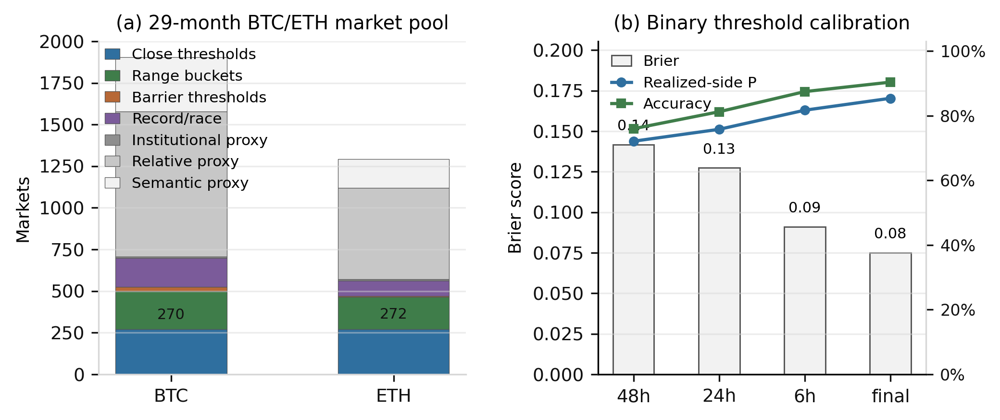
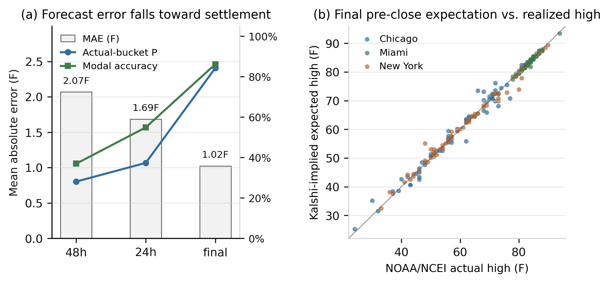
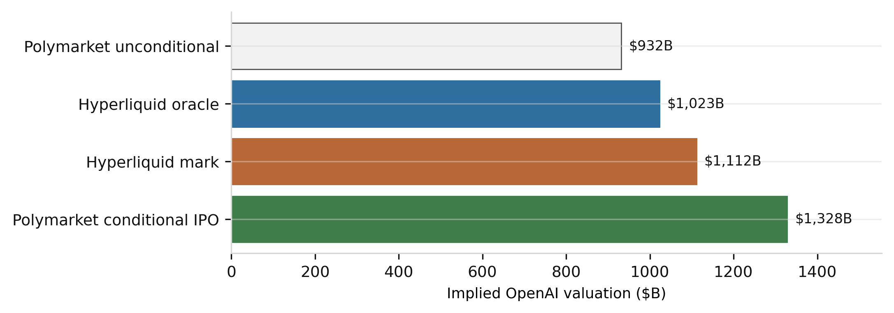

# Semantic State Prices: Inferring Latent Indices from Prediction-Market Event Securities

**Ojas Shukla**  
Sybilian  
ojas@sybilian.com  
May 8, 2026

## Abstract

Prediction markets trade thousands of binary contracts whose payoffs are tied to future states of the world. These contracts are usually interpreted one at a time: a probability that Bitcoin will exceed a threshold, that a city temperature will fall in a range, that the Federal Reserve will choose a rate, or that a private company will reach a valuation. This paper develops a framework for interpreting collections of related prediction-market contracts as noisy state-price surfaces over latent variables. The method maps natural-language event rules into payoff functions, projects observed prices onto the nearest coherent distribution over an underlying state, and reports the resulting expectation as a tradable index candidate. The same construction yields an oracle design for perpetual futures on states that do not have spot markets.

The empirical section validates the method across two venues. On Polymarket, a BTC/ETH entity pool is constructed from 3,197 markets spanning 29 calendar months, including close-threshold, range-bucket, barrier, record, institutional, relative, and semantic proxy markets. The direct subset contains 542 close-threshold markets and 423 range-bucket markets; 342 resolved close-threshold markets have usable CLOB pre-close histories and produce final Brier score of 0.075, final directional accuracy of 90.4%, and mean probability assigned to the realized side of 85.4%. On Kalshi, a panel of 195 city-date temperature ladders, comprising 7,496 hourly snapshots across New York, Chicago, and Miami from March 1 to May 4, 2026, is projected into daily high-temperature distributions and compared with NOAA/NCEI daily maximum temperatures. The Kalshi panel shows mean absolute error of 2.07F at 48 hours before close, 1.69F at 24 hours, and 1.02F at final pre-close, with final modal-bucket accuracy of 86.2%. The paper then demonstrates the method on a non-traded private-company state: OpenAI's 2027 IPO valuation. A 1,030-market OpenAI semantic pool spans direct valuation, model-capability, product, legal/governance, competitor, and sector markets. Direct valuation contracts imply a 24.0% no-IPO probability and a $1.152T unconditional valuation index; the conservative semantic-pocket adjustment gives $1.150T. Hyperliquid pre-IPO perps provide an external live benchmark: `vntl:OPENAI` marks near $1.112T in the same valuation units.

The contribution is an inverse option-pricing operator for prediction markets. Standard derivative pricing begins with a traded underlying and prices contingent claims from it. Semantic state pricing begins with contingent claims written in natural language and infers the missing underlying.

## 1. Introduction

Modern prediction markets increasingly resemble an option market over reality. They do not merely ask who wins an election. They list thresholds, ranges, brackets, and conditional events over macroeconomic releases, crypto prices, public equities, weather, sports, geopolitics, technology adoption, and private-company outcomes. A single market says whether Bitcoin settles above a strike at a timestamp. A strip of such markets says much more: it traces a discrete survival curve over the terminal price. A market on OpenAI's IPO valuation above $1T is not a spot price for OpenAI, but it is a state-contingent security over OpenAI's future valuation. A collection of such securities can imply a distribution over an otherwise untraded variable.

The paper formalizes that observation. Let `X_T` denote a latent future state: a price, valuation, weather outcome, policy setting, capability index, or local real-estate level. Each prediction-market contract is treated as a binary security whose payoff is a function of `X_T` and possibly auxiliary states. Natural-language market rules determine the payoff function. Observed market prices provide noisy estimates of state-contingent probabilities or risk-neutral prices. A constrained projection then recovers a coherent distribution over `X_T` from the noisy and sometimes inconsistent market observations.

Classical derivative pricing maps an observed underlying process into contingent-claim prices. The inference problem studied here runs in the opposite direction: event-security prices are observed, while the underlying state index is latent. Breeden and Litzenberger show how state prices can be recovered from option prices when the option surface is sufficiently complete. Prediction markets create a more irregular but broader object: an option surface over arbitrary real-world states, written in natural language and scattered across venues. The problem is not only financial interpolation. It is semantic extraction plus coherent projection.

The practical motivation is straightforward. Most economically important variables lack continuous spot markets. Private-company valuations, city-level real estate, AI capability leadership, policy severity, regulatory risk, and geopolitical intensity are priced sporadically. Prediction markets can supply fragmented contingent claims over these variables. If these fragments can be composed into a coherent index, that index can serve as the oracle for perpetual futures or structured products.

The paper makes four claims:

1. Collections of binary prediction markets can be modeled as noisy state-price observations over latent variables.
2. Natural-language market rules can be mapped into payoff functions over those variables.
3. Constrained projection can convert inconsistent event prices into coherent distributions.
4. The resulting distribution can support a rolling oracle, provided manipulation risk is explicitly controlled.

The empirical evidence is intentionally divided into public and private cases. Public cases have known realized outcomes and therefore validate the projection machinery. Private cases have no spot price and demonstrate the intended application.

## 2. Related Work

The paper sits at the intersection of option-implied state prices and prediction-market aggregation.

Black and Scholes (1973) and Merton (1973) provide the canonical route from an underlying price process to option prices. Breeden and Litzenberger (1978) invert part of that relationship by recovering state-contingent claim prices from derivatives of call prices. The present paper keeps the inversion but changes the input: instead of a smooth exchange-traded option chain, the surface consists of binary event contracts with heterogeneous text, maturity, liquidity, and resolution rules.

Prediction markets have long been studied as information aggregation mechanisms. Wolfers and Zitzewitz (2004) survey market design and accuracy. Arrow et al. (2008) argue for prediction markets as mechanisms for aggregating dispersed information. Manski (2006) and Wolfers and Zitzewitz (2006) clarify when prices can be interpreted as probabilities and when equilibrium prices differ from simple mean beliefs. Hanson (2003) develops market scoring rules that are foundational for automated market makers in prediction markets.

This paper differs from that literature in its object of inference. It does not ask whether a single prediction-market price is a calibrated probability. It asks whether many related event prices can be composed into a distribution over a latent continuous or ordinal state. In this sense the paper treats prediction markets as an irregular semantic option surface. The main technical challenge is not merely extracting probabilities. It is recovering a coherent underlying state distribution from markets that were not designed as a formal option chain.

## 3. Semantic State-Price Model

We define the semantic state-price operator as the inverse problem that maps event-security prices into a latent state distribution and its induced index:

```math
\begin{aligned}
\mathcal J_{\theta,T}(q;t)
&=
\sum_{i\in\mathcal M_{\theta,T}(t)}
\omega_i(t)\,
\rho_\tau\!\left(
\ell(A_iq)-\ell(\widetilde p_i(t))
\right)\\
&\qquad\qquad
+\lambda\,\mathrm{KL}\!\left(q\Vert\pi_{\theta,T}\right)
+\mu\left\lVert D^2\log q\right\rVert_2^2
\\[4pt]
\widehat q_{\theta,T}(t)
&=
\operatorname*{arg\,min}_{q\in\Delta_K}
\mathcal J_{\theta,T}(q;t),
\\[4pt]
I_{\theta,T}(t)
&=
\sum_{k=1}^{K}x_k\,\widehat q_k(t),
\qquad
\ell(p)=\log\frac{p}{1-p}.
\end{aligned}
\tag{1}
```

This equation is the central object of the paper. \(\mathcal M_{\theta,T}(t)\) is the selected market pocket for target \(\theta\) and horizon \(T\); \(A_i\) is the semantic payoff map from market text into state buckets; \(\omega_i\) is the learned source weight; \(\rho_\tau\) is a robust loss; \(\pi_{\theta,T}\) is the prior state distribution; and \(I_{\theta,T}\) is the inferred index.

Let \(X_T\) denote the latent state at horizon \(T\). It can be a traded public price, a private valuation, an official weather statistic, a policy setting, or a constructed index. Each prediction-market contract \(i\) has:

```math
\begin{aligned}
p_i      &= \text{observed YES price},\\
e_i      &= \text{event text and resolution rule},\\
A_i(x)   &= \Pr(\text{YES payoff}\mid X_T=x),\\
\omega_i &= \text{statistical and semantic weight},\\
T_i      &= \text{resolution time},\\
L_i      &= \text{liquidity, depth, spread, and freshness features}.
\end{aligned}
```

For direct threshold markets:

```math
\text{"Bitcoin above \$76,000 on April 10?"}
\qquad
A_i(x)=\mathbf{1}\{x>76000\}.
```

For direct range markets:

```math
\text{"High temp in NYC is 64-65F on May 7?"}
\qquad
A_i(x)=\mathbf{1}\{64 \le x \le 65\}.
```

For private-company valuation markets:

```math
\text{"OpenAI IPO closing market cap above \$1T by Dec. 31, 2027?"}
\qquad
A_i(x)=\mathbf{1}\{x\ge 1000B,\ \text{IPO by }T\}.
```

For semantic proxy markets:

```math
\text{"Will Anthropic have the best AI model by year-end?"}
\qquad
A_i(x)=\sigma(\alpha_i+\beta_i\log x+\gamma_i^\top c_i).
```

The semantic layer maps the text and rules into \(A_i\). It does not set prices. Pricing comes from observed markets; coherence comes from projection.

Represent the latent distribution on a grid:

```math
q_k=\Pr(X_T\in B_k),\qquad q\in\Delta_K.
```

Let `A` be the matrix whose `i,k` entry is the payoff of market `i` in state bucket `k`. The estimated distribution solves:

```math
\widehat q
=\arg\min_{q\in\Delta_K}
\sum_i \omega_i\bigl(A_iq-p_i\bigr)^2+\lambda R(q)
\quad
\text{s.t. threshold monotonicity and bracket coherence.}
```

`R(q)` is a smoothness or regularization penalty. It can be omitted for simple range partitions and increased when the state grid is dense.

The index is:

```math
I_T=\mathbb{E}_{\widehat q}[X_T]=\sum_k x_k\widehat q_k.
```

For valuation-like variables, log space may be more stable:

```math
I_T^{geo}=\exp\left(\mathbb{E}_{\widehat q}[\log X_T]\right).
```

For IPO markets, include a no-IPO atom:

```math
\begin{aligned}
q_0 &= \Pr(\text{no IPO by }T),\\
I_{\text{uncond}} &= \sum_{k>0} \widehat q_k x_k,\\
I_{\text{IPO}} &= \sum_{k>0}\frac{\widehat q_k}{1-\widehat q_0}x_k.
\end{aligned}
```

## 4. Market Selection and Semantic Weights

Prediction-market data is not a clean option chain. It contains stale markets, ambiguous rules, overlapping outcomes, wide spreads, idiosyncratic settlement details, and proxy markets that are directionally relevant but not direct claims on the target state. The weighting function therefore matters as much as the payoff parser.

For each market, the empirical artifact records a feature vector:

```math
z_i=(\ell_i,\ r_i,\ s_i,\ d_i,\ m_i,\ h_i,\ a_i,\ c_i).
```

Here \(\ell_i\) is liquidity and quote freshness, \(r_i\) is semantic relevance to the target, \(s_i\) is rule specificity, \(d_i\) is semantic distance, \(m_i\) is maturity fit, \(h_i\) is historical family calibration, \(a_i\) is attack cost or depth, and \(c_i\) is concentration or duplication risk. Direct range and close-threshold markets get high relevance and specificity; model-leadership, legal, governance, competitor, or sector markets enter as lower-weight proxy observations.

The baseline source weight is a generalized inverse-variance weight:

```math
\omega_i
=
\frac{\exp(\beta^\top z_i)}
{\widehat\sigma^2_{g(i)}+\sigma^2_{\text{micro},i}
 +\sigma^2_{\text{semantic},i}+\sigma^2_{\text{attack},i}+\epsilon}.
```

The denominator separates four failures: the historical error of the market family `g(i)`, microstructure noise from spreads and stale quotes, semantic noise from proxy distance, and manipulation risk from shallow source books. The numerator allows a learned or specified prior over useful features.

The preferred empirical objective is not plain least squares. For binary prices near zero or one, probability-space residuals underweight tail errors. The stronger form uses the logit residuals, robust loss, and entropy prior in the semantic state-price equation:

```math
\widehat q
=\arg\min_{q\in\Delta_K}
\sum_i \omega_i\,
\rho_\tau\!\left[
\operatorname{logit}(A_iq)-\operatorname{logit}(\tilde p_i)
\right]
+\lambda\,\mathrm{KL}(q\Vert \pi_T)
+\mu\lVert D^2\log q\rVert_2^2 .
```

\(\tilde p_i\) clips observed prices away from zero and one, \(\rho_\tau\) is a Huber loss, \(\pi_T\) is a prior distribution at the target horizon, and the smoothness penalty prevents a sparse proxy basket from creating implausible spikes. The simple least-squares operator remains useful for transparent tables, but the logit-Huber-KL form is the better production equation.

Weights should be learned where resolved histories exist. The calibration problem is:

```math
\widehat\beta
=
\arg\min_\beta
\sum_{j\in\mathcal V}
\mathcal L\!\left(y_j,\widehat p_j(\beta)\right)
\xi\lVert\beta-\beta_0\rVert_2^2 ,
```

where \(\mathcal V\) is a validation set of resolved markets and \(\mathcal L\) is log loss or Brier score. Until enough resolved data exists for a proxy family, the system uses a conservative prior: direct close/range/valuation markets receive the highest weight; barrier markets receive less; capability and product markets receive still less; legal, competitor, and sector proxies receive low weight and are shrinkage-adjusted rather than allowed to dominate the index.

The reporting metrics are Brier score, log loss, calibration error, realized-side probability, projection residual, effective number of markets, family concentration, and attack elasticity. A source market is useful only if it improves out-of-sample calibration or materially increases semantic coverage without making the oracle easy to move.

## 5. Rolling Perpetual Oracle

A perpetual future cannot be anchored to a single fixed-expiration ladder. The oracle should maintain a constant maturity:

```math
\mathrm{OPENAI}_{365}(t)
=
\text{market-implied OpenAI valuation 365 days forward at time }t.
```

At each update:

1. New source markets enter if they pass semantic and liquidity filters.
2. Stale prices are excluded or downweighted.
3. Near-expiry markets decay in forward relevance.
4. Resolved markets become calibration observations.
5. The latent distribution is refit.
6. The index rolls back to constant maturity.

Funding can use the standard mark-versus-oracle form:

```math
\mathrm{funding}_t
=
\kappa(C_t)\log\left(\frac{P^{perp}_t}{I_t}\right).
```

The logarithm is not cosmetic. For positive variables such as prices and valuations, multiplicative errors are more stable than dollar errors: a 10% miss at $200B and a 10% miss at $2T are economically similar. The same logic applies to funding, where \(\log(P^{perp}_t/I_t)\) is the continuously compounded premium of the tradable mark over the oracle. For bounded probabilities the analogous transform is logit; for variables that can be negative or naturally additive, such as temperature, the linear state is preferable.

Confidence should determine leverage, open-interest caps, funding caps, and pause conditions. A minimal confidence function should include:

```math
C_t
=f\!\left(
\text{projection residual},
\text{semantic coverage},
\text{source depth},
\text{spreads},
\text{concentration},
\frac{\text{estimated attack cost}}{\text{perp open interest}}
\right).
```

This last term is essential. If a perp has large open interest and the source markets are thin, a trader can profit by manipulating the source markets that feed the oracle.

## 6. Data

The empirical artifact uses:

- Polymarket Gamma event discovery and CLOB price-history/order-book endpoints.
- Kalshi market and candlestick endpoints.
- Normalized Polymarket/Kalshi market catalog snapshots for market discovery.
- NOAA/NCEI daily weather summaries for realized temperature outcomes.
- Hyperliquid perpetual-market data for private-company perp benchmarks.

The market-surface inventory shows that the object is broader than one OpenAI ladder. Polymarket contains matched surfaces in crypto terminal prices, private-company valuation, AI capability semantics, macro policy, public equity/index events, and weather/climate. Kalshi has recurring series for BTC and ETH ranges, Nasdaq-100 ranges, CPI, Core CPI, Fed funds, and city high-temperature ranges.

The empirical tests below separate direct identification from proxy coverage. Direct threshold or range markets are used for validation when resolved outcomes are available. Proxy markets are included in the entity pools and in the OpenAI semantic adjustment only with conservative shrinkage.

## 7. Empirical Results: Polymarket Crypto Entity Pools

The Polymarket validation uses BTC and ETH because the market texts include many different event types around the same underlying entities. Direct close-threshold markets have deterministic payoff maps:

```math
\text{"Bitcoin above \$K on DATE?"}
\qquad
A_i(S_T)=\mathbf{1}\{S_T>K\}.
```

Barrier, record, ETF, exchange, relative-race, and semantic proxy markets are kept in the entity pool but not treated as identical to close-threshold claims. They increase coverage and become useful once their loadings are calibrated, but the direct binary validation below uses only resolved close-threshold contracts with usable pre-close CLOB histories.

The pool contains 3,197 BTC/ETH markets over 29 calendar months, from March 29, 2024 to January 1, 2027. It includes 542 close-threshold markets, 423 direct range-bucket markets, and 2,232 lower-specificity barrier or proxy markets.

**Table 1. Polymarket BTC/ETH market pool.**

| Asset | Close thresholds | Range buckets | Barrier | Record/race | Institutional proxy | Relative proxy | Semantic proxy | Total |
|---|---:|---:|---:|---:|---:|---:|---:|---:|
| BTC | 270 | 230 | 25 | 172 | 10 | 872 | 326 | 1,905 |
| ETH | 272 | 193 | 6 | 92 | 7 | 548 | 174 | 1,292 |
| Total | 542 | 423 | 31 | 264 | 17 | 1,420 | 500 | 3,197 |

For the direct close-threshold subset, the script fetches Polymarket CLOB `batch-prices-history` for YES tokens and evaluates the market's pre-close probability against the resolved YES/NO outcome. This avoids the fragility of reconstructing spot prices from external feeds and directly tests whether the binary securities assigned probability to the side that actually settled.

**Table 2. Direct close-threshold calibration.**

| Snapshot | N | Brier | Log loss | Accuracy | Mean probability on realized side |
|---|---:|---:|---:|---:|---:|
| 48h before close | 212 | 0.142 | 0.434 | 75.9% | 72.1% |
| 24h before close | 250 | 0.127 | 0.384 | 81.2% | 75.8% |
| 6h before close | 342 | 0.091 | 0.288 | 87.4% | 81.7% |
| Final pre-close | 342 | 0.075 | 0.235 | 90.4% | 85.4% |

The empirical point is structural. Resolved binary event markets form a dense, month-scale calibration set, direct threshold claims improve monotonically as settlement approaches, and lower-specificity proxy markets can be added to a broader entity-level index without being treated as direct claims.



## 8. Empirical Results: Kalshi Multi-Month Temperature Panel

The strongest current validation is the Kalshi weather panel. Weather has three advantages: the contracts are recurring, the state variable is continuous but discretized by ranges, and realized outcomes are available from official NOAA/NCEI daily summaries.

The panel uses high-temperature range contracts for New York City, Chicago, and Miami from March 1 to May 4, 2026. Each city-date has a small mutually exclusive ladder such as:

```math
\{x<64,\ 64\le x\le65,\ 66\le x\le67,\ 68\le x\le69,\ 70\le x\le71,\ x>71\}.
```

Each hourly snapshot is normalized into a distribution over temperature buckets and converted into an expected high temperature. The reference value is NOAA/NCEI `TMAX`.

**Table 3. Kalshi temperature panel coverage.**

| Quantity | Value |
|---|---:|
| Cities | 3 |
| Dates per city | 65 |
| Date-city panels | 195 |
| Hourly snapshots | 7,496 |
| Actual source | NOAA/NCEI daily summaries |

**Table 4. Horizon robustness.**

| Snapshot | N | Mean absolute error | Median absolute error | Mean actual-bucket probability | Modal accuracy |
|---|---:|---:|---:|---:|---:|
| 48h before close | 195 | 2.07F | 1.31F | 0.281 | 0.369 |
| 24h before close | 195 | 1.69F | 1.24F | 0.373 | 0.549 |
| Final pre-close | 195 | 1.02F | 0.53F | 0.843 | 0.862 |

The monotone improvement across horizons is important. At 48 hours, the market-implied distribution is wider and less concentrated on the realized bucket. At 24 hours, the expected value improves and modal accuracy rises. Near close, the distribution typically collapses around the realized outcome. This is the expected behavior of a market-implied state distribution.



The city-level results are heterogeneous. Miami is easiest in the current sample, with final modal accuracy of 100%. New York also performs strongly, with final modal accuracy of 96.9%. Chicago is weaker, with final modal accuracy of 61.5%, producing most of the panel's final error. This matters for the general framework: source-market quality varies by market family, venue, and underlying. A production oracle should learn reliability by family rather than assume all event markets are equal.

## 9. Private-Company Demonstration: OpenAI 2027

The private-asset demonstration uses OpenAI 2027 IPO valuation markets on Polymarket as the direct anchor, then adds a semantic pocket of related OpenAI markets. The relevant direct state has a no-IPO atom and valuation buckets conditional on an IPO. The broader pool contains model-capability markets, product-release markets, legal/governance markets involving Sam Altman, Elon Musk, Microsoft, or corporate structure, competitor-capability markets for Anthropic, Claude, Gemini, Grok, DeepSeek, and other frontier systems, and lower-weight AI-sector proxies.

The raw valuation ladder is not coherent. Some bracket probabilities sum above one and some threshold probabilities violate monotonicity. This is precisely why projection is necessary. The semantic pocket is also not treated as a valuation ladder. It enters as a signed low-shrinkage factor:

```math
I_{\text{semantic}}
=
I_{\text{direct}}\cdot
\exp\!\left(\zeta\tanh\left[
\frac{\sum_{i\in\mathcal P}\omega_i s_i\operatorname{logit}(p_i)}
{\sum_{i\in\mathcal P}|\omega_i|}
\right]\right),
```

where \(\mathcal P\) is the active proxy pocket, \(s_i\) is the sign of the loading, and \(\zeta=0.08\) is a conservative shrinkage coefficient until the proxy-family loadings can be cross-validated at scale.

**Table 5. OpenAI 2027 valuation and semantic pocket.**

| Quantity | Value |
|---|---:|
| OpenAI pool markets | 1,030 |
| Active pool markets | 215 |
| Active priced proxy markets in semantic signal | 187 |
| Effective semantic market count | 433.2 |
| Pool span | 33 months |
| No-IPO probability, direct ladder | 0.240 |
| IPO probability, direct ladder | 0.760 |
| Direct expected valuation, unconditional | $1.152T |
| Semantic-adjusted valuation, unconditional | $1.150T |
| Direct expected valuation, conditional on IPO | $1.515T |
| Semantic-adjusted valuation, conditional on IPO | $1.513T |

The OpenAI value reported here is a market-implied state index, not an analyst appraisal. It is inferred from direct valuation claims plus a transparent, low-weight semantic proxy pocket. The direct ladder identifies the valuation distribution; the broader pool improves coverage and should receive more weight as its historical loadings are learned.

## 10. Live Perp Benchmark: Hyperliquid Pre-IPO Markets

Hyperliquid provides a useful external benchmark because builder-deployed `vntl` pre-IPO perps already trade OpenAI, Anthropic, and SpaceX in units of company valuation billions. If `OPENAI = 500`, the implied valuation is $500B.

**Table 6. Hyperliquid private-company perp benchmark.**

| Market | Mark | Oracle | Mark/oracle | Open interest | 24h volume | Mean annualized funding |
|---|---:|---:|---:|---:|---:|---:|
| ANTHROPIC | $1.157T | $974B | 18.71% | $6.89M | $0.94M | 127.20% |
| SPACEX | $1.832T | $1.647T | 11.19% | $3.39M | $1.19M | 31.44% |
| OPENAI | $1.112T | $1.023T | 8.61% | $3.35M | $0.52M | 24.76% |

The OpenAI comparison is especially useful:

**Table 7. OpenAI state-price and perp comparison.**

| Source | Value |
|---|---:|
| Polymarket unconditional index | $1.152T |
| Polymarket semantic-adjusted index | $1.150T |
| Hyperliquid `vntl:OPENAI` oracle | $1.023T |
| Hyperliquid `vntl:OPENAI` mark | $1.112T |
| Polymarket conditional-IPO valuation | $1.515T |

The Hyperliquid mark is close to, but below, the unconditional Polymarket state-price values, while the conditional-IPO value is higher. That relationship is consistent with the interpretation that prediction-market binaries infer state-contingent distributions, while the perp mark reflects a tradeable synthetic exposure with funding, liquidity, and risk premia.



## 11. Manipulation and Oracle Safety

An oracle built from prediction markets is exposed to source-market manipulation. The correct unit of risk is not only prediction error; it is index movement per dollar of source-market pressure.

Define:

```math
\begin{aligned}
s_i(\delta) &= |I(p_i+\delta)-I(p_i)|,\\
C_i(\delta) &= \text{displayed source-market depth crossed to move }p_i\text{ by }\delta,\\
V_i(\delta) &= \frac{s_i(\delta)}{C_i(\delta)}.
\end{aligned}
```

For the OpenAI 2027 ladder, perturbing each source market by plus or minus five YES-probability points gives:

**Table 8. OpenAI oracle stress.**

| Quantity | Value |
|---|---:|
| Baseline unconditional index | $1.152T |
| Max one-market index move | $24B |
| Median one-market index move | $8B |
| Stress confidence score | 0.979 |

The production implication is an oracle architecture. The semantic state-price operator is the primitive that creates the latent index. The market-design layer then turns that index into a settlement object by specifying smoothing, constituent caps, depth requirements, and attack-cost constraints. The distinction is the same one used in mature derivatives markets: pricing theory defines the object, while exchange rules determine margin, settlement, and market integrity.

```math
\begin{aligned}
I^{raw}_t &= \mathrm{SSP}(\theta,T;t),\\
I^{settle}_t &= \mathcal G\!\left(
\mathrm{TWAP}_{depth}(I^{raw}_t),
C_t,
\text{source caps},
\text{attack-cost limits}
\right).
\end{aligned}
```

This decomposition is what makes the construction viable for perps. SSP supplies the economic state price; \(\mathcal G\) supplies market integrity. The same separation is standard in mature derivatives markets: pricing theory defines the object, while margin and settlement rules make the object tradeable at size. For semantic perps, the production wrapper should include order-book-depth-aware attack costs, trade-weighted or depth-weighted TWAPs, spread penalties, source exclusion, maximum single-market influence, funding caps, and open-interest caps.

## 12. Discussion

The central empirical finding is that prediction-market event pools can be treated as noisy state-price surfaces. The Polymarket crypto pool validates binary threshold calibration on public financial variables across a dense month-scale sample rather than a few handpicked dates. The Kalshi weather panel validates the distribution projection across a larger non-crypto sample with official settlement data. The OpenAI ladder plus semantic pocket demonstrates the private-asset use case, and Hyperliquid provides an external live perp benchmark in the same units.

The broader claim is not limited to private-company valuation. The surface inventory shows recurring state-price structures across crypto, macroeconomic releases, weather, public equity indices, and policy variables. Prediction markets are becoming a general substrate for contingent claims over the world. The paper's operator is a way to convert those claims into indices.

This generality is also the main risk. Semantic proxy markets are not direct claims. A model-ranking market may be relevant to an AI-company valuation, but the loading is uncertain and time-varying. A weather range contract is nearly deterministic conditional on the realized temperature. A private-company IPO threshold is direct but conditional on a corporate event. A geopolitical event may be related to an index but only through a complex causal path. The framework should therefore report semantic coverage and residual uncertainty rather than hide them.

## 13. Boundary Conditions

The framework separates three objects that are often conflated: the event-market price, the inferred latent index, and the tradeable settlement oracle. Prediction markets supply state-contingent claims; the semantic state-price operator produces the index; the production oracle adds market-integrity constraints. This separation is what lets the method use broad semantic market pools without pretending that every source market has the same evidentiary weight.

Current boundary conditions:

1. The Polymarket crypto pool is dense, but many BTC/ETH markets are proxy markets rather than direct close-threshold claims; they should not receive direct-market weight until calibrated.
2. The close-threshold crypto validation is binary calibration, not a full multi-strike terminal-price reconstruction for every date.
3. The Kalshi panel is robust but limited to weather; more macro, financial, and public-equity series should be added.
4. The private-company result is a demonstration, not a validated ground-truth forecast.
5. The manipulation-cost model uses displayed depth and fixed shocks, not a full TWAP adversary model.
6. Semantic proxy loadings are specified conservatively and need large-scale cross-validation before they can dominate direct valuation claims.

These boundary conditions define the next research program: estimate proxy loadings across many resolved families, fit attack-cost models from live order books, and standardize the settlement wrapper for semantic perps.

## 14. Conclusion

Prediction markets are no longer merely isolated yes/no wagers. They are beginning to form a semantic option surface over real-world states. That surface is irregular, sparse, and written in natural language, but it can be projected into coherent latent distributions when related markets are mapped into payoff functions over the same target variable.

This paper proposes the semantic state-price operator:

```math
\mathrm{SSP}(\theta,T)
=
\Pi_{\Delta}
\left(
p,\ A(\theta,T),\
\omega(z;\widehat\beta),\
\mathcal C_{\text{coherence}}
\right).
```

The operator converts fragmented event securities into indices. Those indices can be validated on public variables, used to infer private variables, and potentially deployed as perpetual-futures oracles with appropriate safety constraints.

The empirical evidence now spans two venues and multiple market families: a 3,197-market, 29-month Polymarket BTC/ETH entity pool, a multi-month Kalshi weather panel, a 1,030-market OpenAI semantic pool, and Hyperliquid pre-IPO perp benchmarks. The evidence is strong enough to motivate the framework and explicit enough to keep the implementation honest. The remaining work is to expand the validation universe, estimate semantic loadings, and build a manipulation-cost model suitable for production-scale perps.

## Methods

### Polymarket crypto reconstruction

The script pages Polymarket Gamma crypto events and classifies BTC/ETH markets into close thresholds, range buckets, barrier thresholds, record/race markets, institutional proxies, relative proxies, and semantic proxies. YES token IDs are read from each market record. For resolved direct close-threshold markets, historical prices are fetched directly from Polymarket CLOB `batch-prices-history`; snapshots at 48h, 24h, 6h, and final pre-close are compared with the resolved YES/NO outcome. The reported metrics are Brier score, log loss, directional accuracy, and probability assigned to the realized side.

### Kalshi temperature reconstruction

Kalshi high-temperature markets are grouped by city and date using series tickers `KXHIGHNY`, `KXHIGHCHI`, and `KXHIGHMIA`. Each city-date group contains range and tail contracts that partition the daily high temperature. Hourly candlesticks are fetched from Kalshi's market candlestick endpoint. At each snapshot, bucket prices are normalized into a discrete distribution. The expected high temperature is compared with NOAA/NCEI `TMAX` from the daily summaries service for stations `USW00094728`, `USW00094846`, and `USW00012839`.

### OpenAI valuation projection

OpenAI valuation contracts are parsed into no-IPO, less-than, between, and above-threshold payoff functions. A no-IPO atom is included. The direct projection solves a constrained weighted problem over valuation buckets. A separate OpenAI semantic pool is built from Polymarket AI and legal/business event tags. Markets are classified into valuation/liquidity, capability/product, legal/governance, OpenAI semantic, competitor capability, and AI-sector proxy categories. Active proxy prices enter only through a signed, shrinkage-adjusted logit signal.

### Weight estimation

Weights combine market type, liquidity, maturity fit, specificity, semantic distance, historical calibration, and manipulation risk. For public families with resolved outcomes, the weight parameters can be learned by minimizing validation log loss or Brier score. For sparse private-company proxy families, the artifact uses conservative prior weights and reports the direct and semantic-adjusted indices separately.

### Oracle stress

For each OpenAI source market, the observed probability is perturbed up and down by five percentage points. The latent distribution is refit, and the index movement is recorded. The stress table reports the maximum and median one-market index movement under this fixed probability shock. A production oracle should extend this step with live order-book attack costs and TWAP adversary simulations.

## Data and Code Availability

All generated files are in this public repository. Key outputs:

- `data/polymarket_crypto_entity_pool.md`
- `data/polymarket_crypto_entity_pool.json`
- `data/polymarket_crypto_entity_pool.csv`
- `data/polymarket_crypto_threshold_validation.csv`
- `data/openai_semantic_market_pool.md`
- `data/openai_semantic_market_pool.json`
- `data/openai_semantic_market_pool.csv`
- `data/kalshi_temperature_panel_20260301_20260504.md`
- `data/openai_20271231_projection.md`
- `data/hyperliquid_vntl_private_perps.md`
- `data/openai_20271231_oracle_stress.md`
- `data/prediction_market_surface_inventory.md`
- `figures/figure_2_polymarket_crypto.png`
- `figures/figure_3_kalshi_panel.png`
- `figures/figure_4_openai_bridge.png`

## References

1. Black, F. and Scholes, M. (1973). The Pricing of Options and Corporate Liabilities. *Journal of Political Economy*. https://doi.org/10.1086/260062
2. Merton, R. C. (1973). Theory of Rational Option Pricing. *Bell Journal of Economics and Management Science*. https://doi.org/10.2307/3003143
3. Breeden, D. T. and Litzenberger, R. H. (1978). Prices of State-Contingent Claims Implicit in Option Prices. *Journal of Business*. https://doi.org/10.1086/296025
4. Wolfers, J. and Zitzewitz, E. (2004). Prediction Markets. *Journal of Economic Perspectives*. https://www.aeaweb.org/articles?id=10.1257/0895330041371321
5. Manski, C. F. (2006). Interpreting the Predictions of Prediction Markets. *Economics Letters*. https://doi.org/10.1016/j.econlet.2006.01.004
6. Wolfers, J. and Zitzewitz, E. (2006). Interpreting Prediction Market Prices as Probabilities. NBER Working Paper. https://www.nber.org/papers/w12200
7. Arrow, K. J. et al. (2008). The Promise of Prediction Markets. *Science*. https://digitalcommons.chapman.edu/esi_pubs/40/
8. Hanson, R. (2003). Logarithmic Market Scoring Rules for Modular Combinatorial Information Aggregation. https://hanson.gmu.edu/mktscore.pdf
9. Hayek, F. A. (1945). The Use of Knowledge in Society. *American Economic Review*. https://www.jstor.org/stable/1809376
10. Polymarket CLOB market data documentation. https://docs.polymarket.com/market-data/overview
11. Polymarket CLOB order book documentation. https://docs.polymarket.com/trading/orderbook
12. Kalshi market data documentation. https://docs.kalshi.com/getting_started/quick_start_market_data
13. NOAA/NCEI daily summaries data service. https://www.ncei.noaa.gov/access/services/data/v1
14. Hyperliquid perpetuals info endpoint documentation. https://hyperliquid.gitbook.io/hyperliquid-docs/for-developers/api/info-endpoint/perpetuals
